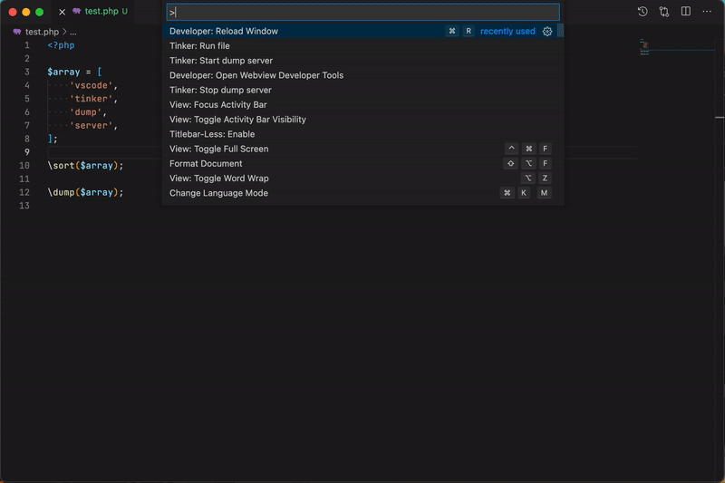

# vscode-tinker

Laravel Tinker and Laravel dump server integration for vscode.

## Commands

* `vscode-tinker.tinker.run`: Tinker: Run file
* `vscode-tinker.dump-server.start`: Tinker: Start dump server
* `vscode-tinker.dump-server.stop`: Tinker: Stop dump server

## License

The project is released under the MIT license. Read the [license](https://github.com/Tarik02/vscode-tinker/blob/master/LICENSE) for more information.
